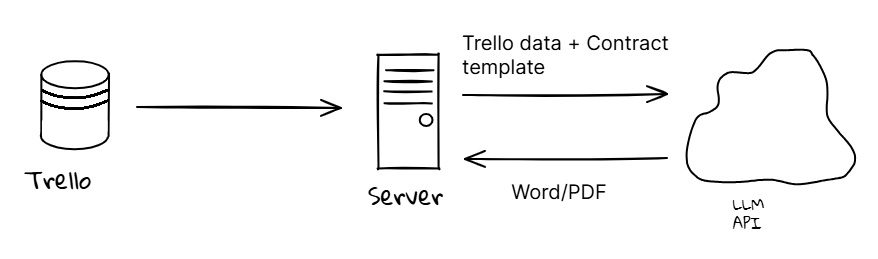

## Idea

Mr. J has expressed, that one of the biggest pain points, is having to assemble a contract from the various Trello tasks. 

For this, we could make an **Automatic Contract Generator**. If we can get an example of a Trello board and a contract, we should be able to make a solution, that can call the Trello API, collect the data and merge it into a contract.

### Contract template

We need a contract template from the customer. We can adjust the template to have mergefields such as `{{number-of-guests}}`, `{{price}}`, etc. This should make it easy to insert the data into the contract, once available. Most languages have a `.replace()` method that we can use here.

### Trello API

We can collect the data from Trello using their REST API. With this, we should be able to gather all the necessary information that is needed to form a contract.

### LLM API

We can send the Trello data to an LLM API endpoint, along with a template for the contract, and ask it to fill out the contract.

### Architechture

This is how I imagine the various integrations should work together.

1. Gather data from Trello API
2. Send data and Contract template to LLM-API
3. LLM-API return a Word/PDF document

This should work out fine as an MVP.