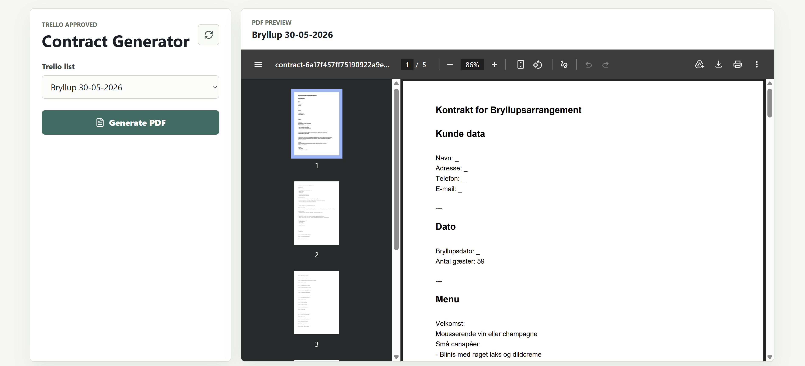

## Frontend

We'll need a frontend, so that the end user can use the automatic contract generator. On entering, frontend should load all the Trello lists, where all tasks have been completed. If there's a list with incomplete tasks, then it shouldn't appear in the options for generating a PDF. User should be able to generate a PDF, and preview the result in the browser.

Let's make it:

```
Additionally, make a frontend that can select the various Trello
list titles where all tasks are approved. It should be possible to click a generate button when a Trello list is
selected, that will generate the PDF and display a preview

Requirements:
- The frontend must be made in React (JavaScript), using Vite
- The frontend should only display the Trello list names where all tasks are completed
- The frontend should have a button, that calls the backend to generate a contract as a PDF, for the selected Trello list
- The frontend should display a preview of the generated PDF
- Update the SPEC.md if necessary
- Update the README.md if necessary
```

## Endgame

We'll wrap this project up here. This is the final result:




### Bugs

There are some minor bugs about

- Wedding date from Trello list title is not inserted into the contract
- In the frontend, the dropdown menu of selectable Trello lists still shows archived Trello lists
- All the PDF's have the exact same name, because it has been **hardcoded**

I'm sure there are other things I've missed, but these stood out to me the most. They can be ironed out at a later time. The project is at least usable now, so it is ready to ship.

## Project

Visit the full project solution:



## What we've learned

- The experience of building something for a customer
- Integrating to Trello's REST API
- LLM API's can't create base64 encoded PDFs