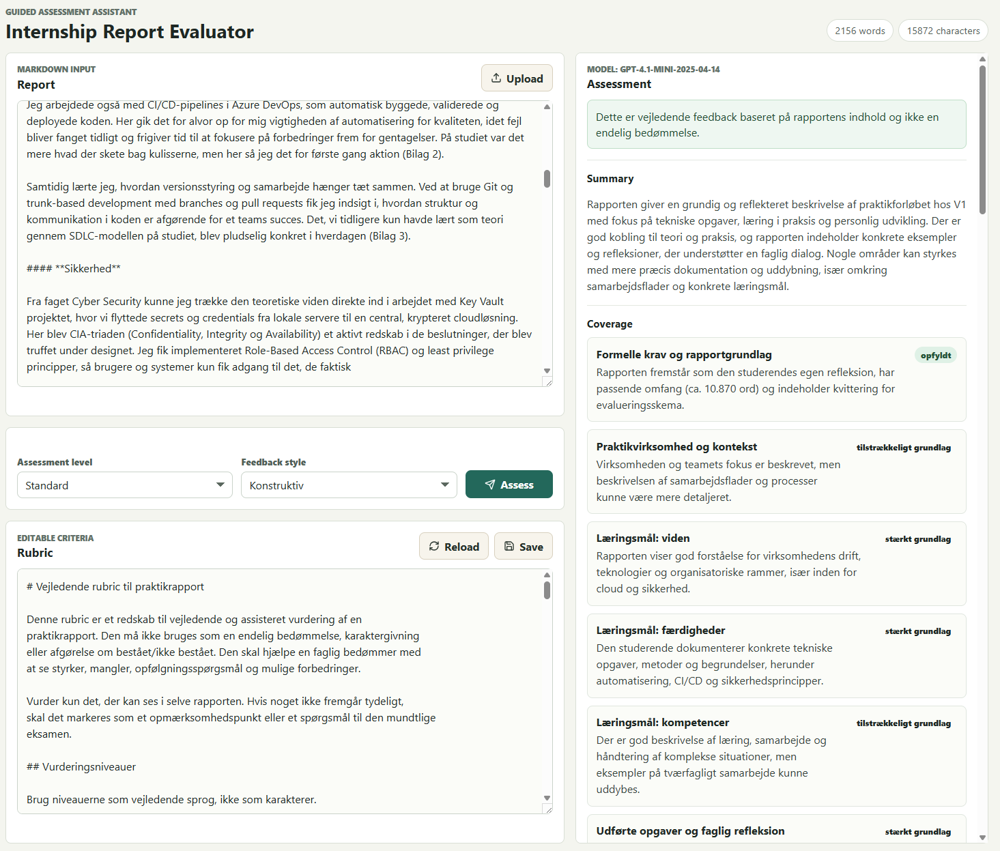
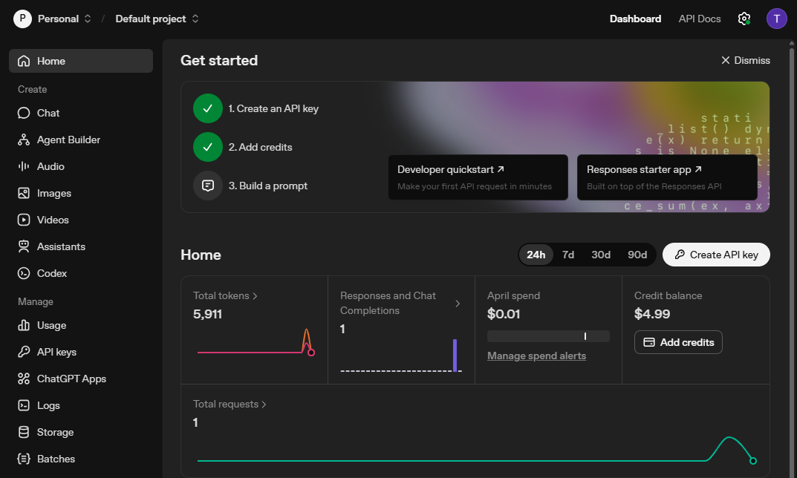

## The idea

In this article, I will show how to create an AI-driven application. The goal is to create an application, that can integrate with an LLM-API. If you want the code, check out the full project here:



## AI assisted assessment

We want to make an application that can take an internship report as input, and in return receive an assessment of the report as output. The assessment should be based on:

- <a class="btn" href="/Portfolio/files/krav-til-rapport.md" download>Requirements for the report</a>
- <a class="btn" href="/Portfolio/files/dare-share-care.md" download>Educational key values</a>
- <a class="btn" href="/Portfolio/files/læringsmål" download>Learning goals</a>

### System prompts & User prompts

When integrating with an LLM-API you need to provide a **System prompt** and a **User prompt**, but what's the difference?

| Aspect                 | System Prompt                                         | User Prompt                            |
| ---------------------- | ----------------------------------------------------- | -------------------------------------- |
| **Who writes it**      | Developer / system                                    | End user                               |
| **Purpose**            | Defines overall behavior, rules, and role             | Asks for a specific task or response   |
| **Priority**           | Highest priority                                      | Lower than system prompt               |
| **Scope**              | Applies to the entire conversation                    | Applies to a single request (or turn)  |
| **Content type**       | Instructions, constraints, tone, persona              | Questions, commands, inputs            |
| **Flexibility**        | Usually fixed or hidden from the user                 | Fully controlled by the user           |
| **Examples**           | “You are a helpful assistant. Avoid harmful content.” | “Explain black holes in simple terms.” |
| **When they conflict** | Overrides the user prompt                             | Must adapt to system rules             |

We're going to make a **System Prompt** to set up the rules of the behavior. This is going to be a static file. Once created, we don't touch it.

The **User prompt** however, should contain the report, when we send it to the LLM-API. The way we're going to do this, is by making some **merge fields** in the template for the User prompt. This way, we can easily merge the report in the User prompt before we send it to the LLM-API.

### Build

To build the application, we're going to use a code agent. If you're not familiar with code agents, check out this article:



**Steps:**

1. Open PowerShell (or your preferred terminal)
2. Navigate to a folder where you keep your projects `cd C:\Projects`
3. Create a new folder `mkdir InternshipReportEvaluator`
4. Enter the new folder `cd .\InternshipReportEvaluator`
5. Create a new folder `mkdir data`
6. Create a new folder `mkdir prompts`
7. Open your code agent `codex`
8. Type `/plan` to enter Plan mode
9. Provide the following prompt:


    

```
I need to make an application that can take an internship report as input, and return an AI generated assessment with feedback.

The application should:

1. Receive an internship report as a markdown file
2. Use a rubric to make the assessment
3. Send prompts to an LLM using an API
4. Receive a response from the model
5. Return a structured assessment with feedback
   
It is **important** that it should be a guiding/assisted assessment, and not a final assessment.

Requirements:
- Make a rubric from `krav-til-rapport.md`, `dare-share-care.md` and `læringsmål.md` and save it in the prompts folder as markdown
- Make a systemprompt for evaluating internship reports, to be sent when calling the LLM API, and save it in the prompts folder as markdown
- Make a userprompt with a merge field where a report can be inserted, and then sent when calling the LLM API, and save the userprompt in the prompts folder as markdown
- Make the backend of the application in Java using Springboot
- Make the frontend of the application in React
- A user should be able to upload an internship report as markdown in the frontend, and then get an assessment in return
- A user should be able to upload the internship report and edit it in the frontend before sending it for assessment
- A user should be able to edit the rubric in the frontend
- A user should be able to select assessment level or feedback style
- The frontend should display if there are timeout errors or API errors
- The LLM API should always return structured JSON as a response
- The LLM API should be able to integrate with OpenAI's API 
```

    


The code agent will undoubtedly ask some follow up questions, and these may vary based on LLM, model, etc., but just try to answer them to the best of your ability, and help guiding it through the process. 

Given the prompt above, I was able to make the following site:



### LLM API Key

Now we need an API key for an LLM. In the prompt I provided for my code agent, I stated that it is a requirement that it supports OpenAI's API, so for this case, I'm going to get an API key from OpenAI.

Using an LLM API endpoint is not free, as it is costly to use tokens. You need to add credits in order to use your API key.

Once you are logged in to an API platform for an LLM you can just

1. Create an API key
2. Add credits

And it should look like this:



> [!IMPORTANT]
> **Make sure you save your API key somewhere safe.**
>
> API keys are not recoverable. If you lose it, you have to delete it from the API platform and create a new one.

### Test

Let's test it.

My GitHub project always provides the LLM API response in the frontend, so the only thing you need to do is upload an internship report and click **Assess**. 

- <a class="btn" href="/Portfolio/files/student1.md" download>Internship Report 1</a>
- <a class="btn" href="/Portfolio/files/student2.md" download>Internship Report 2</a>
- <a class="btn" href="/Portfolio/files/student3.md" download>Internship Report 3</a>

You can see the LLM API response in the frontend too. Here's an example response:


    

```json
{
  "assistantAssessmentNotice": "Dette er vejledende feedback baseret på rapportens indhold og ikke en endelig bedømmelse.",
  "summary": "Rapporten giver en grundig og reflekteret beskrivelse af praktikforløbet hos V1 med fokus på tekniske opgaver, læring i praksis og personlig udvikling. Der er god kobling til teori og praksis, og rapporten indeholder konkrete eksempler og refleksioner, der understøtter en faglig dialog. Nogle områder kan styrkes med mere præcis dokumentation og uddybning, især omkring samarbejdsflader og konkrete læringsmål.",
  "coverage": [
    {
      "item": "Formelle krav og rapportgrundlag",
      "status": "opfyldt",
      "comment": "Rapporten fremstår som den studerendes egen refleksion, har passende omfang (ca. 10.870 ord) og indeholder kvittering for evalueringsskema."
    },
    {
      "item": "Praktikvirksomhed og kontekst",
      "status": "tilstrækkeligt grundlag",
      "comment": "Virksomheden og teamets fokus er beskrevet, men beskrivelsen af samarbejdsflader og processer kunne være mere detaljeret."
    },
    {
      "item": "Læringsmål: viden",
      "status": "stærkt grundlag",
      "comment": "Rapporten viser god forståelse for virksomhedens drift, teknologier og organisatoriske rammer, især inden for cloud og sikkerhed."
    },
    {
      "item": "Læringsmål: færdigheder",
      "status": "stærkt grundlag",
      "comment": "Den studerende dokumenterer konkrete tekniske opgaver, metoder og begrundelser, herunder automatisering, CI/CD og sikkerhedsprincipper."
    },
    {
      "item": "Læringsmål: kompetencer",
      "status": "tilstrækkeligt grundlag",
      "comment": "Der er god beskrivelse af læring, samarbejde og håndtering af komplekse situationer, men eksempler på tværfagligt samarbejde kunne uddybes."
    },
    {
      "item": "Udførte opgaver og faglig refleksion",
      "status": "stærkt grundlag",
      "comment": "Rapporten indeholder konkrete opgaver og reflekterer over tekniske valg og læring med kobling til teori og metoder."
    },
    {
      "item": "Personlige udviklingsmål",
      "status": "tilstrækkeligt grundlag",
      "comment": "Personlige mål og refleksioner er tydelige, især via personlighedstest og samarbejdserfaring, men kunne styrkes med mere konkrete fremtidige udviklingspunkter."
    },
    {
      "item": "Udbytte og værdiskabelse",
      "status": "stærkt grundlag",
      "comment": "Rapporten reflekterer over værdi for både virksomheden og den studerende med konkrete eksempler og feedback."
    },
    {
      "item": "DARE, SHARE, CARE",
      "status": "tilstrækkeligt grundlag",
      "comment": "Der er eksempler på initiativ, videndeling og ansvarlighed, men refleksionerne kunne være mere eksplicit strukturerede omkring DARE, SHARE og CARE."
    },
    {
      "item": "Refleksionskvalitet og eksamensforberedelse",
      "status": "stærkt grundlag",
      "comment": "Rapporten er reflekterende med konkrete eksempler og fagligt sprog, hvilket giver et godt grundlag for mundtlig eksamen."
    }
  ],
  "criteria": [
    {
      "name": "Formelle krav og rapportgrundlag",
      "level": "Stærkt grundlag",
      "evidence": "Rapporten er individuel, indeholder kvittering for evalueringsskema og har passende omfang.",
      "strengths": ["Tydelig personlig refleksion", "Passende omfang", "Dokumentation for evalueringsskema"],
      "improvements": ["Ingen væsentlige forbedringer nødvendige her."],
      "guidingQuestions": ["Er der dokumentation for, at rapporten er den studerendes eget arbejde?"]
    },
    {
      "name": "Praktikvirksomhed og kontekst",
      "level": "Tilstrækkeligt grundlag",
      "evidence": "Beskrivelse af V1 som IT-konsulenthus og Cloud Operations-teamet, men begrænset om samarbejdsflader.",
      "strengths": ["Klar beskrivelse af virksomhedens fokus og teamets arbejdsområde."],
      "improvements": ["Uddyb samarbejdsflader og organisatoriske rammer for bedre kontekst."],
      "guidingQuestions": ["Hvordan er samarbejdet mellem teamet og andre afdelinger eller kunder konkret organiseret?"]
    },
    {
      "name": "Læringsmål: viden",
      "level": "Stærkt grundlag",
      "evidence": "Indsigt i cloud-teknologier, sikkerhedsprincipper og organisatoriske processer dokumenteret gennem konkrete eksempler.",
      "strengths": ["God forståelse for tekniske og organisatoriske rammer.", "Kobling til teori som CIA-triaden og Zero Trust."],
      "improvements": ["Kan styrkes med mere detaljer om virksomhedens overordnede drift."],
      "guidingQuestions": ["Hvordan påvirker virksomhedens forretningsmodel den daglige drift?"]
    },
    {
      "name": "Læringsmål: færdigheder",
      "level": "Stærkt grundlag",
      "evidence": "Beskrivelse af brug af Bicep, CI/CD, Git, sikkerhedskonfiguration og agile metoder.",
      "strengths": ["Konkrete tekniske opgaver og metoder.", "Begrundelser for valg og refleksion over praksis."],
      "improvements": ["Kan uddybe planlægning og prioritering af opgaver mere eksplicit."],
      "guidingQuestions": ["Hvordan planlagde og prioriterede du dine daglige opgaver?"]
    },
    {
      "name": "Læringsmål: kompetencer",
      "level": "Tilstrækkeligt grundlag",
      "evidence": "Beskrivelse af læring, mentorforhold og samarbejde, men begrænset om tværfagligt samarbejde.",
      "strengths": ["God beskrivelse af personlig læring og håndtering af usikkerhed."],
      "improvements": ["Inddrag flere eksempler på tværfagligt samarbejde og professionel deltagelse."],
      "guidingQuestions": ["Kan du give eksempler på samarbejde med andre faggrupper?"]
    },
    {
      "name": "Udførte opgaver og faglig refleksion",
      "level": "Stærkt grundlag",
      "evidence": "Konkrete opgaver med refleksion over tekniske valg og kobling til teori og metoder.",
      "strengths": ["God kobling mellem praksis og teori.", "Refleksion over konsekvenser og læring."],
      "improvements": ["Ingen væsentlige forbedringer nødvendige."],
      "guidingQuestions": ["Hvordan valgte du specifikke tekniske løsninger?"]
    },
    {
      "name": "Personlige udviklingsmål",
      "level": "Tilstrækkeligt grundlag",
      "evidence": "Refleksion over personlighedstest og samarbejde, men mindre fokus på fremtidige udviklingspunkter.",
      "strengths": ["Tydelig selvindsigt og refleksion over samarbejdsroller."],
      "improvements": ["Formuler konkrete fremtidige udviklingsmål og handlinger."],
      "guidingQuestions": ["Hvilke personlige kompetencer vil du arbejde videre med?"]
    },
    {
      "name": "Udbytte og værdiskabelse",
      "level": "Stærkt grundlag",
      "evidence": "Feedback fra kollegaer og konkrete eksempler på værdi skabt for team og kunde.",
      "strengths": ["God dokumentation af værdi for virksomheden.", "Refleksion over gensidig læring."],
      "improvements": ["Ingen væsentlige forbedringer nødvendige."],
      "guidingQuestions": ["Hvordan kunne du skabe endnu mere værdi i praktikforløbet?"]
    },
    {
      "name": "DARE, SHARE, CARE",
      "level": "Tilstrækkeligt grundlag",
      "evidence": "Eksempler på initiativ, videndeling og ansvarlighed, men ikke eksplicit opdelt efter DARE, SHARE, CARE.",
      "strengths": ["Konkrete situationer med initiativ og samarbejde."],
      "improvements": ["Strukturer refleksionerne tydeligere omkring DARE, SHARE og CARE."],
      "guidingQuestions": ["Kan du give konkrete eksempler på, hvordan du har vist mod, delt viden og udvist ansvarlighed?"]
    },
    {
      "name": "Refleksionskvalitet og eksamensforberedelse",
      "level": "Stærkt grundlag",
      "evidence": "Rapporten indeholder konkrete eksempler, fagligt sprog og balancerede vurderinger.",
      "strengths": ["God refleksion og faglig dybde.", "Velegnet til eksamensdialog."],
      "improvements": ["Ingen væsentlige forbedringer nødvendige."],
      "guidingQuestions": ["Hvilke temaer vil du fremhæve til den mundtlige eksamen?"]
    }
  ],
  "nextSteps": [
    "Uddyb samarbejdsflader og organisatoriske rammer i virksomheden for bedre kontekst.",
    "Formuler konkrete fremtidige personlige udviklingsmål med tilhørende handlinger.",
    "Strukturer refleksionerne eksplicit omkring DARE, SHARE og CARE for at styrke denne del.",
    "Forbered eksempler på tværfagligt samarbejde og planlægning af arbejdsopgaver til eksamen.",
    "Overvej at fremhæve temaer og spørgsmål, der kan danne grundlag for en god eksamensdialog."
  ],
  "risksAndUncertainties": [
    "Rapporten indeholder ikke detaljeret beskrivelse af samarbejdsflader, hvilket kan kræve uddybning ved eksamen.",
    "Personlige udviklingsmål er reflekteret, men mangler konkrete fremtidige handlinger.",
    "Refleksionerne omkring DARE, SHARE og CARE er implicitte og kan være svære at vurdere uden uddybning.",
    "Der er begrænset dokumentation for tværfagligt samarbejde, hvilket kan være et opfølgningspunkt."
  ]
}
```

    


## What we've learned

- Difference between a System prompt and a User prompt
- How to integrate to an LLM-API